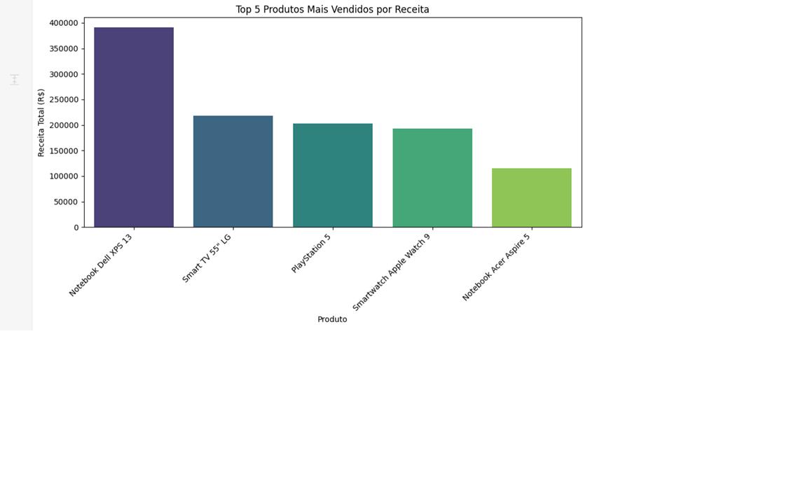
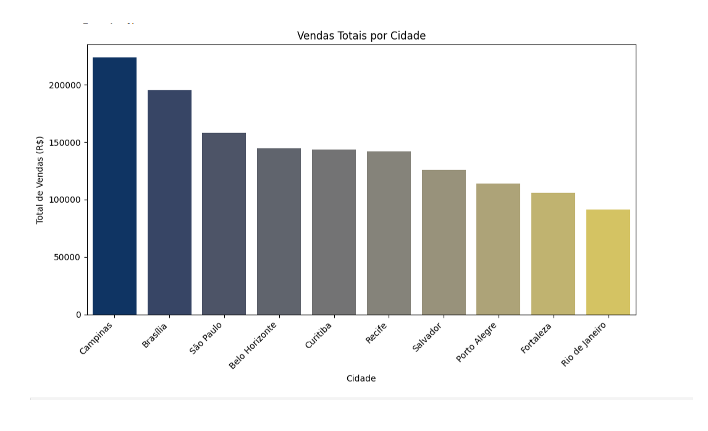

# 📊 Análise Exploratória de Dados de Vendas: Loja de Tecnologia

## Visão Geral do Projeto

Este projeto consiste em uma **Análise Exploratória de Dados (AED)** aplicada a um conjunto de dados de vendas de uma loja de tecnologia. O principal objetivo é descobrir padrões, tendências e insights acionáveis que possam otimizar as estratégias de vendas e marketing do negócio.

Através deste projeto, demonstro as seguintes habilidades essenciais em análise de dados:
-   **Coleta e Preparação de Dados:** Carregamento de dados de um arquivo CSV e garantia de sua qualidade para análise.
-   **Manipulação de Dados:** Utilização da biblioteca Pandas para transformar e agregar dados, tornando-os prontos para insights.
-   **Análise Descritiva:** Cálculo de métricas e estatísticas chave para entender o desempenho de vendas.
-   **Visualização de Dados:** Criação de gráficos claros e informativos usando Matplotlib e Seaborn para comunicar as descobertas de forma eficaz.
-   **Comunicação de Insights:** Apresentação de resultados de forma concisa e relevante para o negócio.

## Conjunto de Dados

O conjunto de dados utilizado, `vendas_tecnologia.csv`, simula transações de vendas de diversos produtos eletrônicos. Ele inclui as seguintes colunas:
-   `ID_Venda`: Identificador único de cada transação de venda.
-   `Data`: Data em que a venda foi realizada.
-   `Produto`: Nome do item vendido.
-   `Categoria`: Categoria do produto (e.g., Celulares, Notebooks, Acessórios).
-   `Quantidade`: Número de unidades do produto vendidas naquela transação.
-   `Preco_Unitario`: Preço de uma única unidade do produto.
-   `Total_Venda`: Valor total da transação.
-   `Cidade`: Localização (cidade) onde a venda ocorreu.
-   `Canal_Venda`: Canal de vendas utilizado (Online, Loja Física).

## Ferramentas Utilizadas

Este projeto foi desenvolvido utilizando **Python** e as seguintes bibliotecas:
-   **Pandas:** Essencial para a manipulação, limpeza e análise estruturada dos dados.
-   **Matplotlib:** Biblioteca fundamental para a criação de gráficos e visualizações estáticas.
-   **Seaborn:** Construída sobre o Matplotlib, utilizada para gerar visualizações estatísticas mais complexas e esteticamente agradáveis.
-   **Jupyter Notebook:** Ambiente interativo que facilitou o desenvolvimento, teste de código e documentação da análise passo a passo.

## Análise e Insights Chave

A análise exploratória dos dados de vendas revelou diversos insights importantes:

* **Performance Geral de Vendas:**
    * **Receita Total:** A loja gerou uma receita total de **R$ [1.444,900.00]**.
    * **Média de Venda por Pedido:** A média por pedido foi de **R$ [R$9.632.67]**.
* **Produtos e Categorias de Maior Impacto:**
    * A categoria **[Monitor LG UltraWide]** e **[Smart TV 55" LG]** são as que mais contribuem para a receita geral.
    * O **[Notebook Dell XPS 13]** se destaca como o produto que mais gerou receita.
    * A categoria **Monitor LG UltraWide** e **Smart TV 55" LG** são as que mais contribuem para a receita geral.
* O **[Notebook Dell XPS 13  ]** se destaca como o produto que mais gerou receita.
    

* **Distribuição Geográfica das Vendas:**
    * **Campinas** é o principal mercado da loja, seguido por **Brasilia**. Isso é crucial para ações de marketing regionalizadas.
    


## Como Visualizar e Executar o Projeto

Para explorar esta análise em detalhes:

1.  **Clone o Repositório:**
    ```bash
    git clone [https://github.com/SeuUsuario/AED.git](https://github.com/SeuUsuario/NomeDoSeuRepositorio.git)
    cd AED
    ```
2.  **Crie e Ative um Ambiente Virtual:**
    ```bash
    python -m venv venv
    # No Windows:
    .\venv\Scripts\activate
    # No macOS/Linux:
    source venv/bin/activate
    ```
3.  **Instale as Dependências:**
    ```bash
    pip install pandas matplotlib seaborn jupyter
    ```
4.  **Inicie o Jupyter Notebook:**
    ```bash
    jupyter notebook
    ```
5.  No seu navegador, abra o arquivo `analise_vendas_tecnologia.ipynb` e execute as células para ver a análise completa.

## Próximos Passos e Possíveis Melhorias

Em analise.

---
*Este projeto foi desenvolvido como parte de um aprendizado em Data Science, visando demonstrar habilidades em análise de dados com Python.*